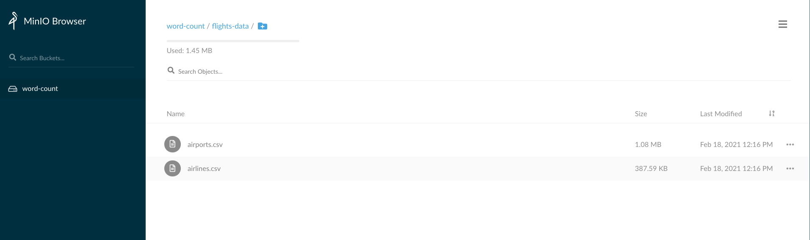
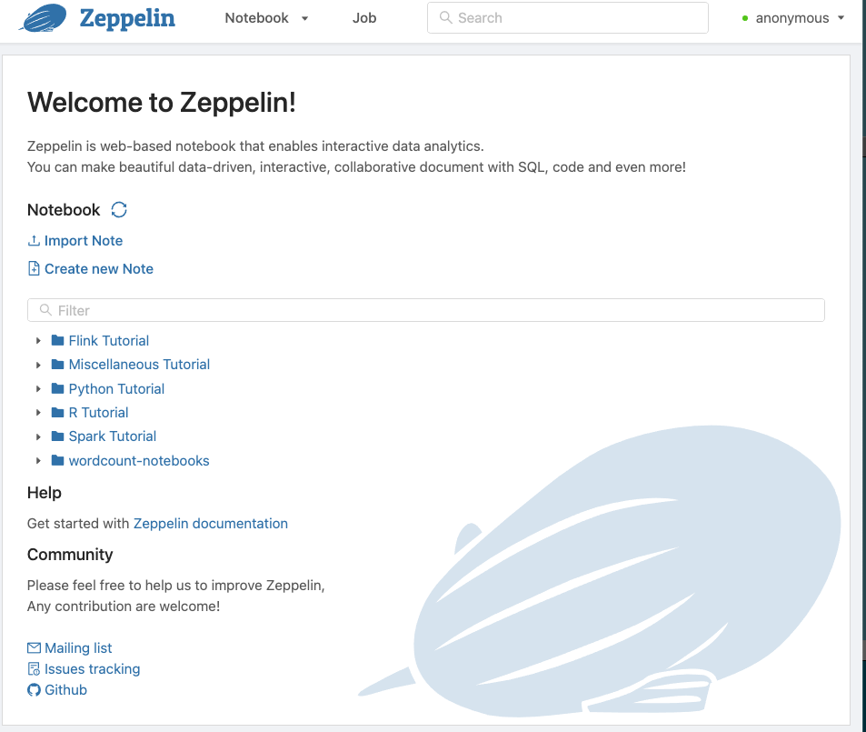
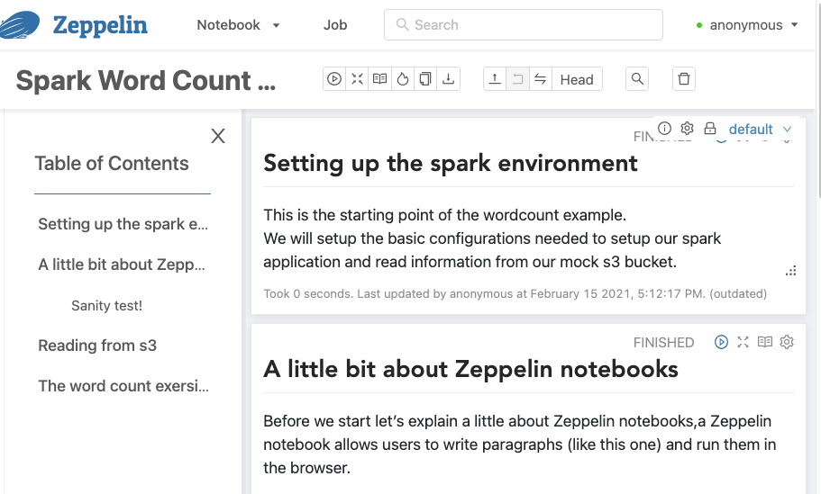

# spark-local-env
A local environment for running a zeppelin notebook with a spark3 engine.

This is a "sandbox" repository for learning about setting up basic spark sandboxes using [zeppelin](https://github.com/apache/zeppelin) and [spark](https://spark.apache.org/) to perform some simple data exploration and manipulation. 

## Prerequisites
* [docker engine version 20.10.2](https://www.docker.com/products/docker-desktop)
* [docker-compose version 1.27.4](https://docs.docker.com/compose/install/)

## Start your local spark environment
* Start your local spark cluster by running: `docker-compose up`
  * This will build local spark docker images for spark master and worker
  * It will start a simple standalone spark cluster with a single worker
  * A minio s3 service will also be launched, you can read more about this super useful project [here](https://github.com/localstack/localstack)
* This may take a few minutes the first time you run
* If you're feeling adventurous, you can start multiple workers by running: 

`docker-compose up --scale zeppelin-spark-worker=2`

**What's happening?**
* Once done, you can open [localhost:8080](http://localhost:8080/) to view the spark master UI.
* You should see the following UI and a single worker node connected to it:

* We've also started a minio instance running a local minio service which we'll use a s3 mock
  * This local "s3" has a single bucket `word-count` with a few csv files that contain information regarding airlines and airports across the world.
  * You can read more about this open source project at [https://github.com/jpatokal/openflights](https://github.com/jpatokal/openflights)
  * You can browse this by opening [localhost:9000](localhost:9000)
    * User: `abc`
    * Password: `xyzxyzxyz`
  * See that we've already pushed a sample data set there
  
  * Download and "peek" at the data:
    You should see an output similar to:
```
21251,"Lynx Aviation (L3/SSX)","","","SSX","Shasta","United States","N"
21268,"Jetgo Australia","","JG",\N,"","Australia","Y"
21270,"Air Carnival","","2S",\N,"","India","Y"
21317,"Svyaz Rossiya","Russian Commuter ","7R","SJM","RussianConnecty","Russia","Y"
```

## Start your local Zeppelin notebook
Now that we have our [standalone spark cluster](http://spark.apache.org/docs/latest/spark-standalone.html) up and running,
we can launch our zeppelin notebook and get to work.
* Run `docker-compose -f docker-compose-zeppelin.yml up` to start a local zeppelin notebook.
* You can access the notebook UI at [localhost:9090](localhost:9090)
  

You can start experimenting with notebooks by opening the `wordcount-notebooks` notebooks:


## What's next?
* Once in the zeppelin ui, choose any of the tutorials and start experimenting.
* The custom tutorial notebook written for this repository are the ones under the `workcount-notebooks`

